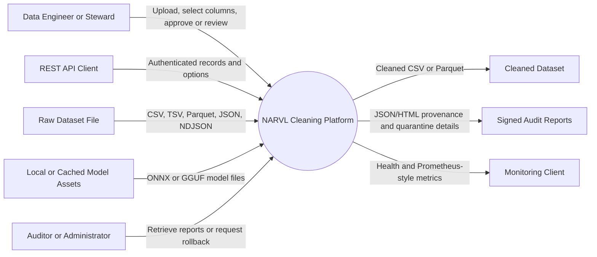
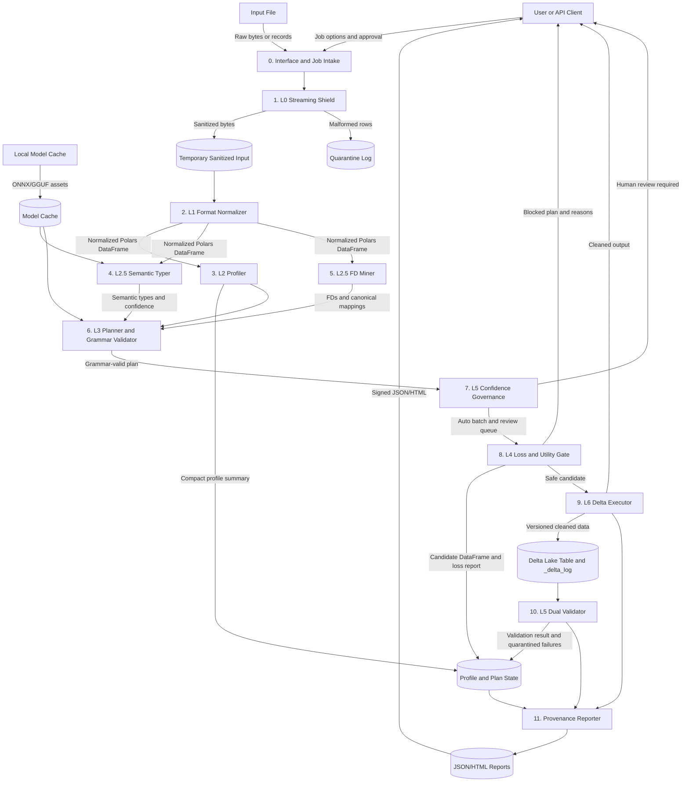
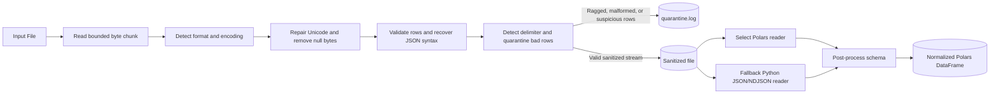
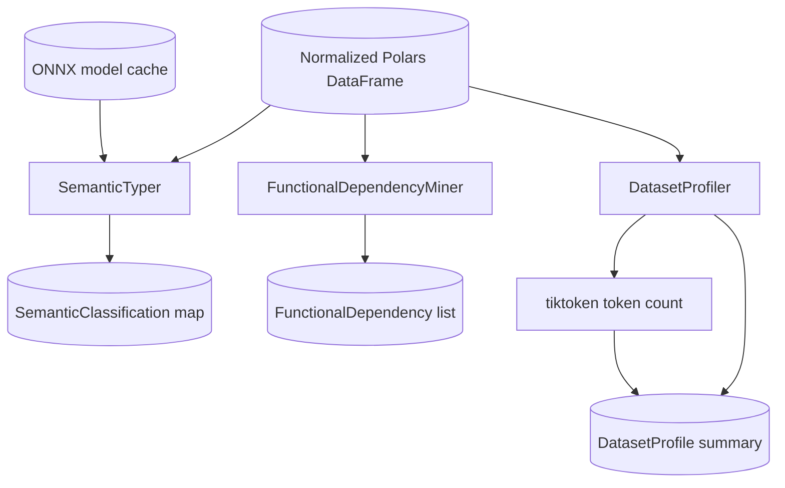
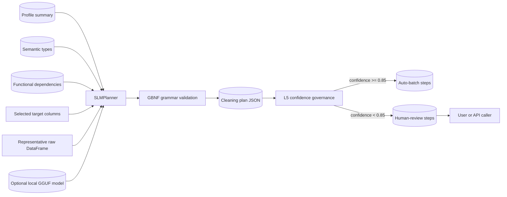
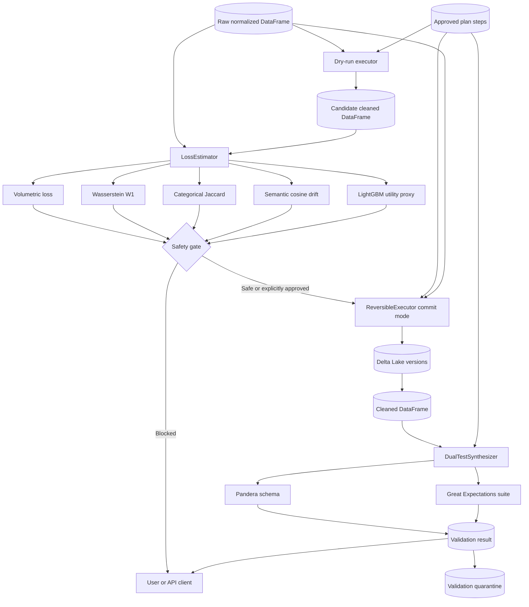
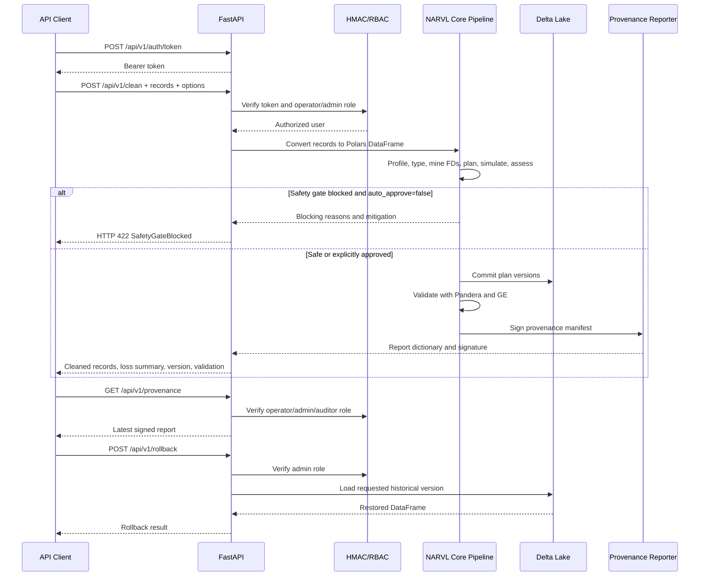
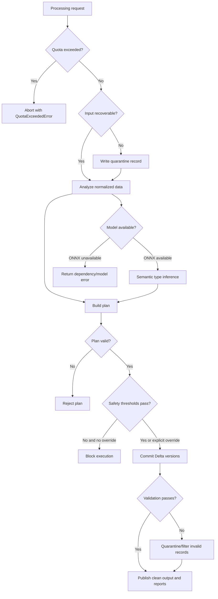

# Data Flow Diagrams
## NARVL Offline Autonomous Agentic Data Cleaning Platform

**Version:** 1.0
**Notation:** Mermaid flowcharts use external entities, processes, data stores, and labeled data flows. Processes are numbered to align with the implementation stages in `guide.md` and `README.md`.

## 1. DFD Scope and Conventions

- **External entities** are users, client applications, input files, and local model assets.
- **Processes** are NARVL services or stage components.
- **Data stores** are temporary files, Delta tables, caches, session state, and reports.
- **Data flows** are records, metadata, plans, validation results, or artifacts.
- The main file pipeline is bounded by L0 through L6. API requests enter through the same core processing services after records are converted to a Polars DataFrame.

## 2. Context Diagram

At context level, NARVL is one data-cleaning system surrounded by users, client applications, local files, optional model assets, and operational consumers.

## 3. Level-1 End-to-End DFD

## 4. Level-2 File Ingestion and Normalization DFD

### Ingestion data controls

- `StreamingShield` maintains `total_bytes` and raises `QuotaExceededError` after the configured limit.
- `charset-normalizer` supplies the selected encoding; UTF-8 is the fallback.
- `ftfy` repairs non-ASCII decoded text.
- JSON recovery may convert malformed object sequences into arrays or extract valid objects with `json.JSONDecoder.raw_decode`.
- Parquet is copied after binary-size validation rather than text-decoded.

## 5. Level-2 Analysis DFD

The normalized DataFrame is read by three analysis branches. They produce metadata rather than a second copy of the entire dataset for the planner.

### Analysis flows

1. `DatasetProfiler.profile` calculates dataset and column metadata, serializes the compact summary, and records token count and duration.
2. `SemanticTyper.infer_types` samples each column, extracts ten features, invokes ONNX Runtime, and returns semantic type/confidence records.
3. `FunctionalDependencyMiner.mine` checks exact mappings and clusters text variants with RapidFuzz before producing confidence-scored dependency records.

## 6. Level-2 Planning and Governance DFD

The planner may use the local SLM, but the deterministic fallback is the authoritative availability path when model loading fails. Grammar validation is applied to either source of plan steps.

## 7. Level-2 Safety, Execution, and Validation DFD

## 8. Level-2 API DFD

## 9. Data Stores and Lifetimes

| Store | Contents | Lifetime |
| --- | --- | --- |
| Temporary sanitized input | Shielded copy of the source file. | Job/session; normally local temporary storage. |
| `quarantine.log` | Malformed, ragged, or rejected input records and reasons. | Job/report directory. |
| Profile/session state | Profile summary, semantic types, FDs, selected columns, plan, loss result, and validation result. | Streamlit session or latest API process session. |
| Model cache | ONNX semantic model and optional GGUF SLM model. | User cache or configured model directory. |
| Delta table | Versioned raw and cleaned snapshots plus `_delta_log`. | Job storage; retained for rollback/audit. |
| Provenance reports | Signed JSON manifest and HTML report. | Report directory or API latest-session state. |
| Cleaned output | CSV or Parquet asset. | User-selected output location. |

## 10. Error and Control Flows

## 11. DFD Security Boundaries

- The ingestion boundary is the first untrusted-data boundary. Quota, format, encoding, null-byte, delimiter, and quarantine controls apply there.
- The planner boundary receives compact metadata and controlled samples rather than an unrestricted raw-data prompt.
- The execution boundary is protected by dry-run loss assessment and the safety gate.
- The API boundary is protected by HMAC-signed Bearer tokens and role checks.
- The audit boundary includes signed provenance and immutable Delta versions.
- The current API latest-session store is process-local; a horizontally scaled deployment would require an external shared store and coordinated authorization.
