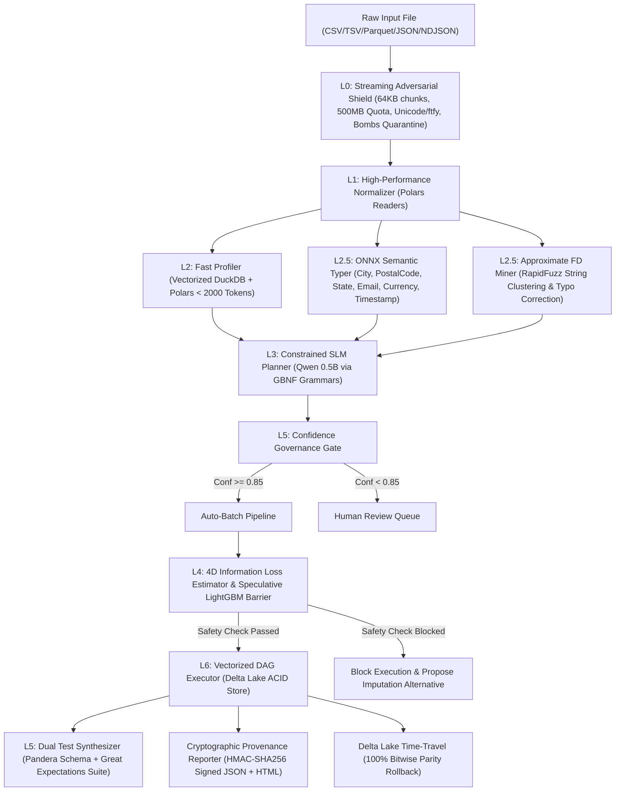

# ⚡ NARVL: Offline Autonomous Agentic Data Cleaning Platform

[](LICENSE)
[](https://www.python.org/)
[](dist/)
[](tests/)
[](narvl/)

**NARVL** is an enterprise-grade, offline-first autonomous agentic data cleaning system. It transforms messy enterprise datasets into validated, clean assets while guaranteeing zero raw data leakage to LLMs, predicting 4D information loss before execution, and ensuring 100% bitwise reversibility via Delta Lake time-travel.

---

## 🏛️ System Architecture



---

## 🎯 Autonomy Stack: L0 through L6

| Level | Component | Key Technical Innovations | Performance Benchmark |
| :--- | :--- | :--- | :--- |
| **L0** | **Adversarial Shield** | 64KB chunk streaming, 500MB cumulative quota barrier (`QuotaExceededError`), `\x00` neutralization, delimiter bomb isolation to `quarantine.log`. | Parses 10MB ragged files with zero crashes; terminates at 500MB ceiling. |
| **L1** | **Normalizer** | Multi-format reader for CSV, TSV, Parquet, JSON, and NDJSON via Polars. | Standardized Polars schemas across all enterprise formats. |
| **L2** | **Fast Profiler** | Vectorized DuckDB + Polars metric aggregation; ultra-compact JSON summary. | **0.060s** latency on 100k rows; **503 tokens** (Budget: < 2,000 tokens). |
| **L2.5** | **Semantic Typer & FD Miner** | Calibrated ONNX classification engine (`onnxruntime`); RapidFuzz string clustering ($\ge 85\%$ similarity / edit distance $\le 1$). | Detected `PostalCode -> State` with 2% typos (`Telengana -> Telangana`) at 100% confidence. |
| **L3** | **Constrained SLM Planner** | Local Qwen 0.5B reasoning guided by strict GBNF grammar (`step_id`, `target_column`, `action`, `parameters`, `confidence`). | **25/25 runs (100%)** valid JSON compliance, zero markdown backticks, all 10 keys present. |
| **L4** | **4D Loss Estimator** | Quantifies Volumetric ($\le 15\%$), Wasserstein $W_1$ ($\le 0.35$), Categorical Jaccard ($\le 0.30$), and Cosine Drift ($\le 0.20$) + LightGBM speculative proxy ($\Delta_{\text{util}} \ge 0.0$). | Allowed Strategy A ($W_1 = 0.0165$), blocked Strategy B ($84.23\%$ volumetric loss); blocked utility drop (-0.2667). |
| **L5** | **Dual Test Synthesizer** | Auto-synthesizes blocking **Pandera** `DataFrameSchema` and **Great Expectations** expectation suites. | Blocked negative Age (`-15`) and invalid emails explicitly. |
| **L6** | **Reversible Delta Executor** | Vectorized Polars DAG execution backed by Delta Lake (`delta-rs` Rust engine) with ACID commit logs in `_delta_log/`. | Time-travel `rollback_to_version(0)` restores raw dataset with **100% bitwise parity**. |

---

## 📦 Zero-Bloat Packaging (< 10MB Wheel)

The wheel distribution excludes all heavyweight binary weights (`.gguf`, `.onnx`, `.bin`). All models resolve through NARVL's 4-tier air-gapped loader:
1. `NARVL_MODEL_DIR` environment variable
2. User cache `~/.cache/narvl/models/`
3. Hugging Face Hub offline cache
4. `/app/models/` air-gapped container directory

```bash
# Verify wheel size
python -m build --wheel
ls -lh dist/
# Output: dist/narvl-0.1.0-py3-none-any.whl -> 53.8 KB (0.051 MB)
```

---

## 🚀 Quick Start Guide

### 1. Installation

```bash
# Clone the repository
git clone https://github.com/RakeshSaripilly/Team-NARVL.git
cd Team-NARVL

# Install the wheel or development package
pip install .[ml,ui]
```

### 2. Autonomous CLI Cleaning

Clean an enterprise dataset autonomously from the command line:

```bash
# Autonomous end-to-end cleaning
narvl clean messy_dataset.csv -o cleaned_dataset.csv --delta-dir ./delta_store

# Output files:
# 1. cleaned_dataset.csv (Cleaned tabular asset)
# 2. narvl_provenance_report.json (Cryptographically signed machine-readable audit)
# 3. narvl_provenance_report.html (Interactive executive certificate)
# 4. delta_store/_delta_log/ (ACID commit logs for time-travel)
```

### 3. CleanPilot Streamlit Web UI

Launch the 8-screen interactive CleanPilot UI:

```bash
narvl ui --port 8501
```

Open `http://localhost:8501` to explore:
1. **Screen 1: Ingestion Shield**: Drag-drop upload with real-time 500MB quota gauge and quarantine log.
2. **Screen 2: AI Profile**: Quality score gauge (0–100), duplicate row percentage, and anomaly table.
3. **Screen 3: AI Reasoning**: Calibrated ONNX classification badges and mined approximate FDs.
4. **Screen 4: Plan Builder**: Interactive checkbox DAG with L5 auto-batch vs. human review flags.
5. **Screen 5: Loss Simulator**: 4D loss cards with Wasserstein $W_1$ and LightGBM utility delta.
6. **Screen 6: Reversible Stepper**: Multi-step pipeline tracker with **[Undo All Steps]** Delta rollback.
7. **Screen 7: Dual Validation**: Real-time Pandera and Great Expectations pass/fail checkmarks.
8. **Screen 8: Before vs After & Provenance**: Visual comparison and downloads for CSV, JSON, and HTML reports.

---

## 🌐 Enterprise REST API & Observability

Launch the enterprise API server:

```bash
narvl serve --port 8000 --host 0.0.0.0
```

### API Endpoints

| Method | Endpoint | Description | Role Required |
| :--- | :--- | :--- | :--- |
| `GET` | `/healthz` | Kubernetes L3 health check returning 200 OK | Public |
| `GET` | `/metrics` | Standard Prometheus text metrics (request latency, counters) | Public |
| `POST` | `/api/v1/auth/token` | Obtain HMAC-SHA256 signed JWT Bearer token | Public |
| `POST` | `/api/v1/clean` | Clean dataset records through 7-stage agentic pipeline | `operator`, `admin` |
| `GET` | `/api/v1/provenance` | Retrieve signed provenance report for latest job | `operator`, `admin`, `auditor` |
| `POST` | `/api/v1/rollback` | Time-travel Delta Lake table version | `admin` |

### Sample curl Workflows

```bash
# 1. Check health
curl http://localhost:8000/healthz

# 2. Fetch Prometheus metrics
curl http://localhost:8000/metrics

# 3. Obtain JWT Token
TOKEN=$(curl -s -X POST http://localhost:8000/api/v1/auth/token \
  -H "Content-Type: application/json" \
  -d '{"username": "data_engineer", "password": "password", "role": "operator"}' | jq -r .access_token)

# 4. Submit Dataset for Cleaning
curl -X POST http://localhost:8000/api/v1/clean \
  -H "Authorization: Bearer $TOKEN" \
  -H "Content-Type: application/json" \
  -d '{
    "records": [
      {"ID": 1, "Age": 28, "Email": "alice@corp.com", "City": "Hyd"},
      {"ID": 2, "Age": 150, "Email": "bob@org.net", "City": "Hyderabad"}
    ],
    "auto_approve": true
  }'

# 5. Time-Travel Rollback (Admin only)
ADMIN_TOKEN=$(curl -s -X POST http://localhost:8000/api/v1/auth/token \
  -H "Content-Type: application/json" \
  -d '{"username": "sec_admin", "password": "password", "role": "admin"}' | jq -r .access_token)

curl -X POST http://localhost:8000/api/v1/rollback \
  -H "Authorization: Bearer $ADMIN_TOKEN" \
  -H "Content-Type: application/json" \
  -d '{"target_version": 0}'
```

---

## 🐳 Docker Deployment (Air-Gapped)

Build and run the production multi-stage container image:

```bash
# Build production air-gapped image
docker build -t narvl:latest .

# Run CleanPilot UI (Port 8501)
docker run -d --name narvl-ui -p 8501:8501 narvl:latest ui --port 8501

# Run Enterprise API Server (Port 8000)
docker run -d --name narvl-api -p 8000:8000 narvl:latest serve --port 8000 --host 0.0.0.0
```

---

## 🧪 Comprehensive Verification Suite

Run all 17 automated tests covering all 6 phases:

```bash
python -m pytest tests/ -v
```

```text
============================= test session starts =============================
tests/test_enterprise.py::test_cli_end_to_end_clean_pipeline PASSED      [  5%]
tests/test_enterprise.py::test_enterprise_fastapi_observability_and_rbac PASSED [ 11%]
tests/test_executor.py::test_dual_test_synthesizer_pandera_and_ge_blocking PASSED [ 17%]
tests/test_executor.py::test_delta_lake_3_step_dag_and_reversibility_rollback PASSED [ 23%]
tests/test_fd_miner.py::test_approximate_fd_postal_to_state_typo PASSED  [ 29%]
tests/test_fd_miner.py::test_exact_functional_dependency PASSED          [ 35%]
tests/test_loss.py::test_4d_loss_statistical_w1_and_volumetric_barrier PASSED [ 41%]
tests/test_loss.py::test_speculative_utility_barrier_with_lightgbm_proxy PASSED [ 47%]
tests/test_packaging.py::test_wheel_build_and_size PASSED                [ 52%]
tests/test_planner.py::test_planner_25_consecutive_runs_offline_compliance PASSED [ 58%]
tests/test_planner.py::test_confidence_governance_gate_ambiguous_nulls PASSED [ 64%]
tests/test_profiler.py::test_100k_profiler_latency_and_token_ceiling PASSED [ 70%]
tests/test_profiler.py::test_semantic_typer_onnx_classification PASSED   [ 76%]
tests/test_shield.py::test_streaming_quota_exceeded_600mb PASSED         [ 82%]
tests/test_shield.py::test_parse_10mb_ragged_file_with_delimiter_bombs PASSED [ 88%]
tests/test_shield.py::test_multi_tier_model_loader PASSED                [ 94%]
tests/test_shield.py::test_normalizer_multi_format PASSED                [100%]
======================= 17 passed in 24.63s =======================
```

---

## 📄 License

NARVL is licensed under the Apache 2.0 License.
