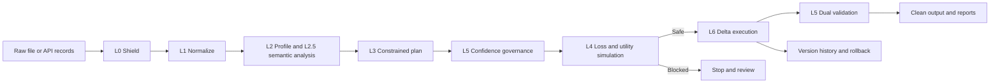

# Software Requirements Specification
## NARVL Offline Autonomous Agentic Data Cleaning Platform

**Version:** 1.0
**Source basis:** `README.md`, `guide.md`, `pyproject.toml`, and the current `narvl/` implementation.

## 1. Purpose

NARVL shall transform messy enterprise tabular data into a cleaned, validated, auditable, and reversible dataset. The system shall operate locally or in an air-gapped environment, protect raw data from uncontrolled model exposure, and stop transformations that exceed configured information-loss or validation limits.

This specification describes the implemented product behavior exposed through the CLI, CleanPilot Streamlit UI, and FastAPI REST API.

## 2. Scope

### 2.1 In scope

- Ingesting CSV, TSV, TAB, Parquet, JSON, NDJSON, and JSONL data.
- Streaming input inspection with encoding detection, Unicode repair, quota enforcement, delimiter detection, and quarantine handling.
- Converting supported inputs into Polars DataFrames.
- Profiling dataset structure, nulls, duplicates, cardinality, distributions, and common text patterns.
- Inferring semantic column types with a local ONNX model.
- Mining exact and approximate functional dependencies and canonical typo mappings.
- Generating constrained cleaning plans with a local SLM when available or a deterministic fallback when it is not.
- Routing plan steps through confidence governance and human-review categories.
- Simulating the proposed plan before committing changes.
- Measuring volumetric, statistical, categorical, semantic, and predictive utility loss.
- Executing approved transformations through Polars.
- Persisting versions in Delta Lake and supporting time-travel rollback.
- Synthesizing and executing Pandera and Great Expectations validation checks.
- Producing signed JSON and HTML provenance reports.
- Serving the workflow through CLI, Streamlit, and REST API interfaces.
- Providing health, metrics, role-based access, provenance, and rollback API endpoints.

### 2.2 Out of scope

- Distributed cluster execution.
- GPU-only processing requirements.
- Automatic correction of every possible domain-specific anomaly.
- External hosted LLM inference as a required dependency.
- Permanent centralized multi-tenant job storage.
- Replacing enterprise identity providers or secret managers.

## 3. Users and Stakeholders

| Stakeholder | Need |
| --- | --- |
| Data engineer | Run repeatable cleaning jobs, select target columns, inspect plans, and retrieve outputs. |
| Data steward | Review ambiguous transformations and inspect data-quality findings. |
| Auditor | Retrieve signed provenance, validation evidence, and execution history. |
| API operator | Submit cleaning jobs and monitor job outcomes programmatically. |
| Administrator | Manage protected rollback operations and operational configuration. |
| Platform owner | Deploy NARVL offline, package it, and maintain model and dependency assets. |

## 4. Operating Context and Assumptions

- Python 3.10 or newer is available.
- Input files are accessible to the local process.
- The process has write access to temporary, Delta, quarantine, and report directories.
- Core data processing uses CPU-compatible local libraries.
- The semantic typer can generate its small ONNX model locally when `onnx` and `onnxruntime` are installed.
- The SLM is optional. If `llama-cpp-python` or a GGUF model is unavailable, the deterministic planner fallback remains available.
- API authentication uses the configured `NARVL_API_SECRET`; production deployments must replace the development default.
- Delta Lake storage is local to the job unless an external URI is supplied through the executor configuration.

## 5. Product Workflow



## 6. Functional Requirements

### 6.1 Ingestion and protection

| ID | Requirement | Acceptance criterion |
| --- | --- | --- |
| FR-01 | The system shall accept CSV, TSV/TAB, Parquet, JSON, NDJSON, and JSONL input. | A supported file reaches normalization or produces a clear input error. |
| FR-02 | The system shall inspect input in bounded chunks. | The shield uses the configured chunk size and does not require the complete file in memory for delimited input. |
| FR-03 | The system shall enforce a cumulative byte quota. | Files exceeding the configured limit raise `QuotaExceededError` and do not continue through the pipeline. |
| FR-04 | The system shall detect encoding and repair malformed Unicode where possible. | Encoding is recorded and non-ASCII text is passed through `ftfy.fix_text`. |
| FR-05 | The system shall isolate malformed or ragged records. | Quarantined records are written to the configured quarantine log and valid records continue when recovery is possible. |
| FR-06 | The system shall neutralize null bytes before text parsing. | Null-byte presence is recorded and null bytes are removed from the sanitized stream. |

### 6.2 Normalization and profiling

| ID | Requirement | Acceptance criterion |
| --- | --- | --- |
| FR-07 | The system shall normalize supported inputs into a Polars DataFrame. | Downstream stages receive a consistent DataFrame regardless of supported source format. |
| FR-08 | The profiler shall report dataset-level metrics. | Row count, column count, duplicate information, event-log status, and identifier indicators are included. |
| FR-09 | The profiler shall report column-level metrics. | Type, null percentage, cardinality, numeric statistics, zero variance, samples, and pattern ratios are available where applicable. |
| FR-10 | The profiler shall produce a compact planner summary. | The serialized summary and token count are exposed through `DatasetProfile`. |
| FR-11 | The UI shall allow selecting all columns, issue-bearing columns, or no columns. | The active target-column state matches the selected action and persists across the plan builder. |

### 6.3 Semantic and relational analysis

| ID | Requirement | Acceptance criterion |
| --- | --- | --- |
| FR-12 | The semantic typer shall classify supported enterprise semantic categories. | Each column receives a type, confidence, and raw probability map. |
| FR-13 | The semantic typer shall reject low-confidence predictions. | Predictions below the configured threshold or classified as `Other` become `Unknown`. |
| FR-14 | The FD miner shall detect exact dependencies. | A dependency is emitted when a determinant maps to one dependent value per group. |
| FR-15 | The FD miner shall detect approximate text dependencies. | Similar variants can produce a canonical mapping with confidence and sample violations. |

### 6.4 Planning and governance

| ID | Requirement | Acceptance criterion |
| --- | --- | --- |
| FR-16 | The planner shall accept profile, semantic, FD, and target-column context. | Generated steps reference available columns and supported actions. |
| FR-17 | The planner shall validate plan structure against the cleaning grammar. | Invalid actions, missing fields, malformed parameters, and invalid plans are rejected. |
| FR-18 | The planner shall support local SLM reasoning without making it mandatory. | A valid deterministic plan is produced when the SLM or model file is unavailable. |
| FR-19 | The system shall route plan steps by confidence. | Steps at or above 0.85 are placed in `auto_batch`; lower-confidence steps are placed in `human_review_queue`. |
| FR-20 | The system shall honor target-column selection. | Steps outside the selected target columns are excluded, except explicitly dataset-wide actions. |

### 6.5 Safety and execution

| ID | Requirement | Acceptance criterion |
| --- | --- | --- |
| FR-21 | The system shall simulate a plan before committing it. | Dry-run execution produces a candidate DataFrame without a Delta commit. |
| FR-22 | The loss estimator shall calculate four information-loss dimensions. | Volumetric, Wasserstein W1, categorical Jaccard, and semantic cosine measurements are returned. |
| FR-23 | The system shall evaluate predictive utility. | A LightGBM proxy compares raw and cleaned utility and returns a utility delta. |
| FR-24 | The safety gate shall block unsafe plans. | Threshold violations create blocking reasons and prevent normal execution unless explicitly overridden. |
| FR-25 | The executor shall support the approved transformation actions. | Deduplication, standardization, clamping, imputation, and regex replacement execute as plan steps. |
| FR-26 | The executor shall support null policy controls. | Numeric nulls use median, categorical/Boolean nulls use mode where safe, and unresolvable nulls may be removed. |
| FR-27 | The executor shall commit versions to Delta Lake. | Initial ingestion and subsequent committed steps are represented by Delta versions and metadata. |
| FR-28 | The system shall support rollback. | An administrator or authorized local operator can restore a prior Delta version. |

### 6.6 Validation and audit

| ID | Requirement | Acceptance criterion |
| --- | --- | --- |
| FR-29 | The system shall synthesize Pandera validation rules. | A DataFrame schema reflects plan-derived ranges, null rules, and email constraints. |
| FR-30 | The system shall synthesize Great Expectations checks. | An expectation suite is created and evaluated against the candidate or cleaned DataFrame. |
| FR-31 | The system shall quarantine or remove records failing configured post-processing rules. | The validation result reports removed records and the resulting cleaned DataFrame. |
| FR-32 | The system shall generate provenance output. | JSON and HTML reports contain hashes, plan, safety results, validation results, and execution metadata. |
| FR-33 | The system shall sign provenance data. | The report includes an HMAC-SHA256 signature produced by the provenance reporter. |

### 6.7 Interfaces and observability

| ID | Requirement | Acceptance criterion |
| --- | --- | --- |
| FR-34 | The CLI shall run an end-to-end cleaning job. | `narvl clean` accepts input, output, Delta, report, approval, column, and null-policy options. |
| FR-35 | The UI shall expose the major workflow stages. | CleanPilot provides ingestion, profiling, reasoning, planning, simulation, execution, validation, and provenance screens. |
| FR-36 | The API shall expose cleaning, provenance, and rollback endpoints. | Authorized requests receive structured results or explicit HTTP errors. |
| FR-37 | The API shall provide health and metrics endpoints. | `/healthz` reports service readiness and `/metrics` reports request/job counters. |
| FR-38 | The API shall enforce role-based authorization. | Operator/admin roles can clean; auditor can retrieve provenance; only admin can rollback. |

## 7. Non-Functional Requirements

### 7.1 Performance

- The profiler should remain within the documented sub-2.5-second target for the 100,000-row benchmark.
- The profile summary should remain below the documented 2,000-token budget.
- Input inspection shall use bounded chunks and enforce the 500 MB default quota.
- Vectorized Polars operations should be preferred over Python row-by-row transformations for large tabular data.

### 7.2 Safety and privacy

- Raw records shall not be sent to a hosted model service as a required part of processing.
- Plans shall be simulated before durable execution.
- Unsafe loss assessments shall be visible through blocking reasons.
- Identifiers and emails shall not receive fabricated null replacements.
- Quarantined input and validation failures shall remain inspectable through logs or report metadata.

### 7.3 Reliability and recoverability

- A malformed input record shall not crash the complete ingestion job when quarantine recovery is possible.
- Delta commits shall preserve prior versions.
- Rollback shall restore a selected historical snapshot.
- Optional model components shall degrade to deterministic fallbacks where supported.
- API failures shall increment failure metrics and return structured HTTP errors.

### 7.4 Security

- Protected API endpoints shall require Bearer authentication.
- HMAC-SHA256 signatures shall be verified with constant-time comparison.
- API roles shall restrict cleaning, audit retrieval, and rollback operations.
- Deployment secrets shall be supplied through environment configuration rather than committed source code.

### 7.5 Maintainability

- Stage boundaries shall remain represented by the existing `narvl.core` and `narvl.engine` modules.
- Plans shall remain machine-readable and grammar-validated.
- Reports shall remain available in both JSON and HTML forms.
- Tests shall cover the shield, profiler, planner, loss estimator, executor, packaging, API, and enterprise flows.

## 8. External Interfaces

### 8.1 CLI

```text
narvl clean DATASET [-o OUTPUT] [--delta-dir DIR] [--report-dir DIR]
                   [--auto-approve] [--columns COL1,COL2]
                   [--no-resolve-nulls]
narvl ui [--port PORT]
narvl serve [--port PORT] [--host HOST]
```

### 8.2 REST API

| Method | Endpoint | Authorization |
| --- | --- | --- |
| GET | `/healthz` | Public |
| GET | `/metrics` | Public |
| POST | `/api/v1/auth/token` | Public token issuance |
| POST | `/api/v1/clean` | `operator` or `admin` |
| GET | `/api/v1/provenance` | `operator`, `admin`, or `auditor` |
| POST | `/api/v1/rollback` | `admin` |

### 8.3 File outputs

- Cleaned CSV or Parquet output.
- Delta table and `_delta_log` metadata.
- `quarantine.log` for isolated input records.
- `narvl_provenance_report.json`.
- `narvl_provenance_report.html`.

## 9. Data Requirements

### 9.1 Cleaning plan step

Every plan step should contain the grammar-defined fields:

- `step_id`
- `target_column`
- `issue`
- `rule`
- `action`
- `parameters`
- `confidence`
- `justification`
- `loss_potential`
- `test_criterion`

Supported action families currently include `deduplicate_exact`, `standardize_values`, `clamp_bounds`, `knn_impute`, and `regex_replace`.

### 9.2 Session and state data

The UI maintains raw and cleaned DataFrames, profile summary, semantic types, FDs, selected columns, plan steps, active steps, loss assessment, validation result, executor state, Delta directory, and provenance artifacts in Streamlit session state.

The API maintains the latest executor, Delta path, raw DataFrame, cleaned DataFrame, and provenance report in in-memory session state. This is suitable for a single-process deployment but is not a substitute for shared multi-instance job storage.

## 10. Acceptance Test Summary

A release candidate should demonstrate:

1. Supported file ingestion and quarantine behavior.
2. Correct compact profiling and anomaly detection.
3. Semantic classification for representative enterprise columns.
4. Exact and fuzzy FD discovery.
5. Valid constrained plans across repeated offline runs.
6. Safety blocking for excessive information loss and predictive utility loss.
7. Correct Delta commits and rollback.
8. Pandera and Great Expectations validation behavior.
9. Signed provenance JSON and HTML output.
10. API authentication, RBAC, health, metrics, cleaning, provenance, and rollback behavior.
11. Successful package build and test execution.
