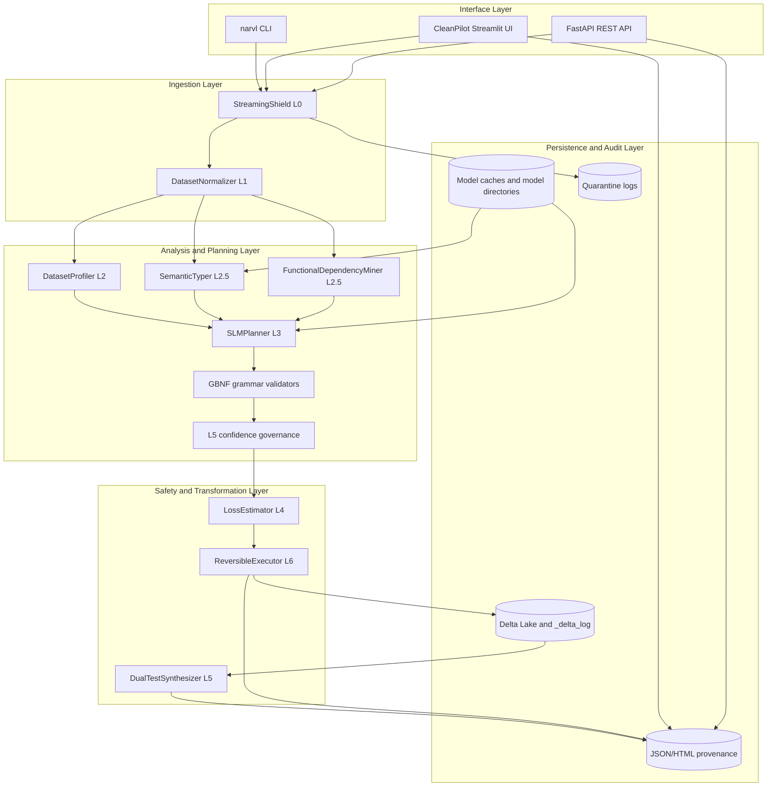
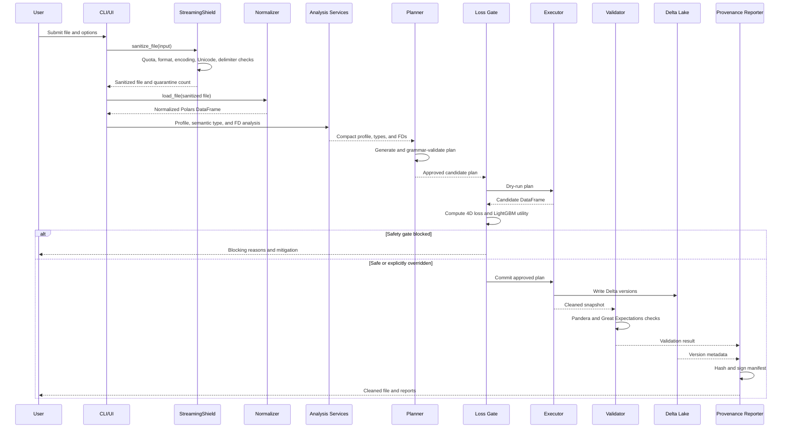
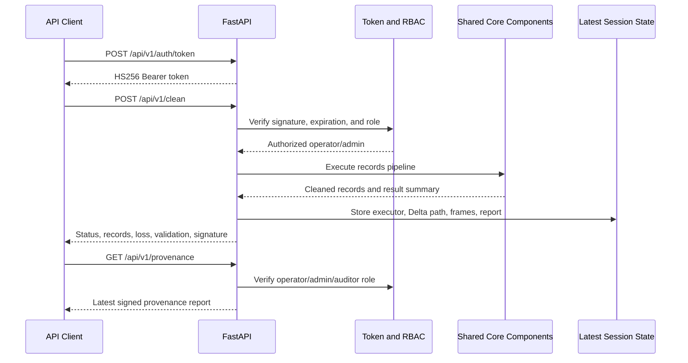
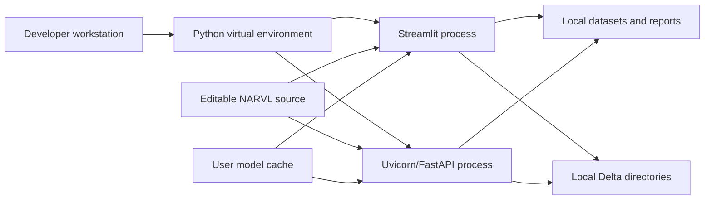
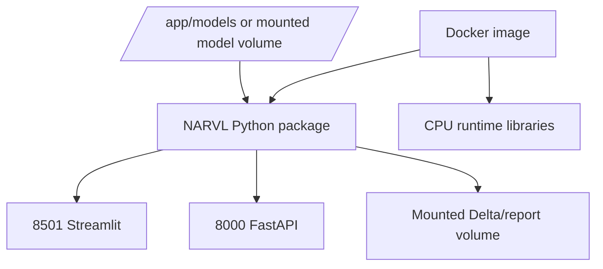
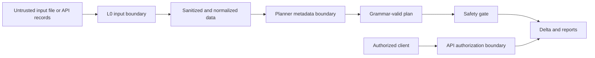

# System Architecture
## NARVL Offline Autonomous Agentic Data Cleaning Platform

**Version:** 1.0
**Source basis:** Current `narvl/` implementation, `README.md`, `guide.md`, `pyproject.toml`, and `Dockerfile`.

## 1. Architectural Intent

NARVL is a local-first pipeline system rather than a single opaque model call. The architecture separates untrusted ingestion, deterministic analysis, optional model reasoning, risk evaluation, reversible execution, validation, and audit reporting.

The primary architectural goals are:

1. **Data safety:** constrain file size, repair or quarantine malformed input, and avoid sending raw datasets to hosted models.
2. **Explainability:** represent recommendations as structured plan steps with rules, confidence, justifications, and test criteria.
3. **Risk control:** simulate plans and measure distribution, semantic, volumetric, and predictive utility changes before durable execution.
4. **Reversibility:** commit each execution stage to Delta Lake and support time-travel rollback.
5. **Offline operation:** use local CPU processing, cached models, deterministic fallbacks, and air-gapped model paths.
6. **Multiple interfaces:** expose the same core pipeline through CLI, Streamlit, and FastAPI.

## 2. Logical Architecture



## 3. Component Decomposition

### 3.1 Interface layer

#### CLI: `narvl/cli.py`

The CLI is the batch orchestration boundary. `run_clean_pipeline` coordinates all stages in a seven-step sequence and writes output files, Delta commits, quarantine logs, and provenance reports. `main` parses `clean`, `ui`, and `serve` subcommands.

#### Streamlit UI: `narvl/ui/app.py`

CleanPilot provides interactive access to the same processing services. Its screens are intentionally separated by workflow stage:

1. Ingestion and upload.
2. Profile and anomaly radar.
3. Semantic reasoning and FD discovery.
4. Plan selection and confidence review.
5. Dry-run loss simulation.
6. Delta execution and rollback.
7. Dual validation.
8. Before/after visualization and provenance downloads.

Streamlit session state holds the current job context. Buttons such as column selection controls update shared target-column state used by the plan builder and executor.

#### REST API: `narvl/api/main.py`

FastAPI provides synchronous endpoints for health, metrics, authentication, cleaning, provenance, and rollback. Request models are defined with Pydantic. The current latest-job state is process-local, which is appropriate for a single-process deployment but requires an external store for multi-instance operation.

### 3.2 Ingestion layer

#### L0 `StreamingShield`: `narvl/core/shield.py`

Responsibilities:

- bounded binary reads;
- 500 MB default quota enforcement;
- format sniffing;
- encoding detection;
- mojibake and Unicode repair;
- null-byte removal;
- delimiter detection;
- malformed-row quarantine;
- JSON syntax recovery.

The shield emits a sanitized path and processing metadata through `ShieldResult`. It is the primary boundary between untrusted input and the rest of the application.

#### L1 `DatasetNormalizer`: `narvl/core/normalizer.py`

Responsibilities:

- format-specific Polars readers;
- JSON/NDJSON fallback parsing;
- nested-record and container-key handling;
- post-load DataFrame normalization;
- source and shield metadata packaging.

The normalized output contract is a `polars.DataFrame` suitable for all later components.

### 3.3 Analysis layer

#### L2 `DatasetProfiler`: `narvl/core/profiler.py`

The profiler produces compact metadata rather than a raw-data prompt. It calculates dataset metrics, column statistics, nulls, duplicates, cardinality, pattern ratios, and token count. Its `DatasetProfile` object is the main planner input.

#### L2.5 `SemanticTyper`: `narvl/core/semantic_typer.py`

The semantic typer extracts normalized features from columns, creates or loads the ONNX graph, and executes inference through ONNX Runtime. It returns confidence-scored semantic classifications. Low-confidence outputs are downgraded to `Unknown`.

#### L2.5 `FunctionalDependencyMiner`: `narvl/core/fd_miner.py`

The FD miner uses grouped Polars operations for exact dependencies and RapidFuzz clustering for approximate text dependencies. It produces canonical mappings that the planner can use for standardization steps.

### 3.4 Planning layer

#### L3 `SLMPlanner`: `narvl/engine/planner.py`

The planner combines profile metadata, semantic types, functional dependencies, selected columns, and controlled raw values. It attempts to use a local GGUF model through `llama-cpp-python`. If model loading fails, deterministic rules produce a valid plan.

#### Grammar validation: `narvl/engine/grammars.py`

The grammar module defines supported actions and required plan keys. `validate_cleaning_step` and `validate_cleaning_plan` provide a hard structural boundary around generated output.

#### L5 confidence governance

The planner partitions valid steps into automatic and human-review queues using the 0.85 confidence threshold. This is a recommendation governance boundary, not the final information-loss safety decision.

### 3.5 Safety and transformation layer

#### L4 `LossEstimator`: `narvl/core/loss.py`

The estimator receives raw and simulated-cleaned DataFrames. It calculates:

- volumetric loss;
- standardized Wasserstein W1 distance;
- categorical Jaccard loss;
- semantic cosine drift;
- LightGBM raw-versus-cleaned utility delta.

It returns a `LossImpactReport` with thresholds, safety verdict, blocking reasons, and mitigation guidance.

#### L6 `ReversibleExecutor`: `narvl/core/executor.py`

The executor applies plan actions with vectorized Polars expressions. It supports dry-run execution and committed execution. Target-column filtering occurs before steps are applied. Null resolution is integrated with semantic types and target-column scope.

#### L5 `DualTestSynthesizer`: `narvl/core/test_gen.py`

The validator creates Pandera schemas and Great Expectations suites from plan steps, validates the cleaned DataFrame, and can filter invalid records into a quarantined DataFrame. Its result records both validation systems and removed-record counts.

### 3.6 Audit and persistence layer

#### Delta Lake

`deltalake.DeltaTable` and `write_deltalake` persist versions, commit metadata, and `_delta_log` transaction history. Version 0 represents raw ingestion, and subsequent commits represent transformations. Historical versions can be loaded for rollback.

#### Provenance reporter

`narvl/core/provenance.py` hashes raw and cleaned DataFrames, builds a manifest, signs it with HMAC-SHA256, and emits JSON and HTML reports.

#### Quarantine outputs

The shield and validation layer preserve malformed input and invalid post-cleaning records as inspectable outputs rather than silently discarding all evidence.

## 4. Runtime Sequences

### 4.1 File cleaning sequence



### 4.2 API cleaning sequence



## 5. Deployment Architecture

### 5.1 Local development deployment



Recommended local launch commands are:

```powershell
.\.venv\Scripts\python.exe -m streamlit run narvl\ui\app.py
.\.venv\Scripts\python.exe -m uvicorn narvl.api.main:app --host 127.0.0.1 --port 8000
```

### 5.2 Air-gapped container deployment

The Docker image packages Python application code and runtime dependencies. Large model weights are excluded from the wheel and can be mounted or baked into `/app/models/`. The container can expose Streamlit on port 8501 or FastAPI on port 8000.



### 5.3 Production scaling considerations

The current implementation is optimized for offline CPU and single-process or controlled local deployments. For multi-instance production operation:

- Move latest-job state out of `LATEST_SESSION` into a shared store.
- Use a shared Delta/object-storage configuration with concurrency policy.
- Move API secrets to a managed secret store.
- Add a job queue for long-running cleaning requests.
- Add structured logging and external metrics aggregation.
- Isolate each job's temporary, quarantine, Delta, and report paths.
- Define model cache ownership and version pinning across workers.

## 6. Model and Dependency Resolution

### 6.1 Semantic ONNX model

`SemanticTyper` generates the calibrated ONNX model under the user cache when no explicit semantic model is supplied. The `onnx` package is needed for graph creation; `onnxruntime` is needed for inference.

### 6.2 SLM GGUF model

`resolve_model_path` checks the following locations in order:

1. `NARVL_MODEL_DIR` direct file or directory.
2. `~/.cache/narvl/models/`.
3. Package resources when bundled.
4. Hugging Face Hub download when allowed.
5. `/app/models/` for air-gapped containers.
6. A local `models/` working-directory fallback.

`load_llama_model` requires `llama-cpp-python`. `SLMPlanner` catches model-loading failure and uses deterministic planning rules instead.

## 7. Security Architecture

### 7.1 Trust boundaries



### 7.2 Controls

- Input quota and chunking limit denial-of-service exposure.
- Encoding, null-byte, delimiter, and quarantine logic protect parsers.
- Planner input is compact and structured.
- Grammar validation prevents arbitrary action shapes.
- Confidence governance separates auto-batch from human review.
- Loss simulation prevents unsafe plans from committing by default.
- HMAC signatures protect provenance integrity.
- Bearer token verification and role checks protect API operations.
- Administrator-only rollback protects historical data state.

## 8. Technology-to-Component Map

| Technology | Architectural component | Reason for use |
| --- | --- | --- |
| Polars | Normalizer, profiler, executor, validator | Fast local tabular processing and vectorized transformations. |
| DuckDB | Profiler | Embedded analytical calculations. |
| charset-normalizer / ftfy | Shield | Robust text decoding and Unicode repair. |
| ONNX / ONNX Runtime | Semantic typer | Portable local model generation and CPU inference. |
| RapidFuzz | FD miner and planner | Approximate text matching and canonicalization. |
| llama.cpp | Optional planner backend | Local constrained language-model reasoning. |
| NumPy / SciPy | Loss estimator and model features | Numerical features, statistics, and Wasserstein distance. |
| LightGBM | Utility barrier | Downstream predictive-signal comparison. |
| Delta Lake | Executor persistence | ACID versions, time travel, and rollback. |
| Pandera / Great Expectations | Validation | Independent schema and expectation checks. |
| Streamlit | Interactive interface | Local workflow visualization and controls. |
| FastAPI / Uvicorn | Service interface | Authenticated REST access and deployment. |
| HMAC / standard library crypto | Provenance and API security | Signing and token verification without a required external identity service. |

## 9. Failure Handling and Recovery

| Failure | Component response | User-visible result |
| --- | --- | --- |
| File exceeds quota | Raise `QuotaExceededError`. | Job stops with quota error. |
| Malformed row | Quarantine and continue where possible. | Quarantine count and log path. |
| Unsupported or unreadable format | Normalizer raises a parse error. | Clear ingestion failure. |
| ONNX model missing | Generate local model or surface dependency/model error. | Semantic stage status or failure. |
| SLM unavailable | Use deterministic planner fallback. | Plan generation continues without hosted inference. |
| Invalid plan | Grammar validator rejects it. | No execution. |
| Loss threshold exceeded | Safety gate blocks unless override is supplied. | Blocking reasons and mitigation. |
| Validation failure | Keep failure details and optionally filter invalid records. | Validation report and removed-record count. |
| API token invalid or role insufficient | Return HTTP 401 or 403. | Unauthorized/forbidden response. |
| Delta rollback requested | Load historical version. | Restored snapshot and version metadata. |

## 10. Architectural Quality Attributes

- **Modularity:** Stage-specific modules expose narrow responsibilities and structured handoff objects.
- **Determinism:** Profiling, fallback planning, feature extraction, and most transformations are locally reproducible.
- **Reversibility:** Delta versions preserve historical states rather than overwriting the only copy.
- **Observability:** CLI progress, UI status, API metrics, validation results, and provenance expose stage outcomes.
- **Portability:** Python packaging, local caches, optional model dependencies, and Docker support workstation and air-gapped deployment.
- **Extensibility:** New plan actions require coordinated grammar, planner, executor, validation, and loss handling rather than changes to a monolithic engine.

## 11. Known Architectural Constraints

1. The FastAPI latest-session store is in memory and process-local.
2. The default API secret in source is a development fallback and must be overridden in production.
3. Some optional native dependencies, especially `llama-cpp-python`, may require platform-specific build tools when no compatible wheel is available.
4. The current loss estimator and semantic typer use samples and deterministic heuristics; they are safety signals, not a universal proof of data correctness.
5. The current Docker and local workflows assume local filesystem access for temporary files, Delta logs, model caches, and reports.
