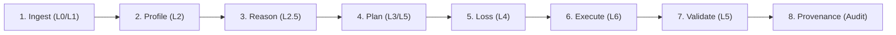

# ⚡ NARVL CleanPilot: Complete Interface Navigation & Presentation Guide

> **Document Purpose**: This guide provides an end-to-end explanation of every single navigation step in the **CleanPilot Web UI** (`narvl/ui/app.py`), detailing **what it does**, **where it exists in the codebase**, **its interactive UI components**, and a **spoken presentation script** for live demonstrations.
> 
> *Note: This walkthrough documents the core NARVL CleanPilot pipeline. Document extension features (`doc_extension/`) are excluded.*

---

## 🏛️ System Overview: The L0–L6 Autonomy Stack

**NARVL** (*Normalized Autonomous Robust Vectorized Lake*) is an offline-first autonomous agentic data cleaning platform. It operates 100% locally on CPU without raw data exposure to external LLMs, guarantees mathematical stability via 4D loss estimation, and provides 100% bitwise reversibility via Delta Lake ACID time-travel.

---

## 🧭 Global Sidebar: System Security & Telemetry

Before navigating the screens, the left sidebar provides continuous situational awareness and air-gapped status:

| Sidebar Indicator | What It Represents | Code Location |
|---|---|---|
| **🔒 Air-Gapped Mode** | Confirms `ACTIVE` status. Ensures zero network telemetry or outbound internet calls are made. All models and libraries execute strictly on local CPU. | [`narvl/ui/app.py:L227-L228`](file:///c:/Users/Anirudh%20Potukuchi/Desktop/Team-NARVL/narvl/ui/app.py#L227-L228) |
| **📦 Delta Log Storage** | Confirms `ACID Compliant` storage powered by `delta-rs` (`_delta_log/`) ensuring transaction atomicity, parity tracking, and time-travel rollback. | [`narvl/ui/app.py:L229`](file:///c:/Users/Anirudh%20Potukuchi/Desktop/Team-NARVL/narvl/ui/app.py#L229) |
| **📊 Active Dataset** | Displays live row count and column dimension once data is loaded (e.g., `Rows: 4,957 | Cols: 8`). | [`narvl/ui/app.py:L231-L236`](file:///c:/Users/Anirudh%20Potukuchi/Desktop/Team-NARVL/narvl/ui/app.py#L231-L236) |

---

## 1️⃣ Screen 1: Ingestion Shield & Streaming Upload

### 🎯 What It Does
- **64KB Chunk Streaming**: Ingests multi-format tabular datasets (CSV, TSV, Parquet, JSON, NDJSON) in binary chunks without loading the entire raw file into memory at once.
- **500MB Cumulative Quota Barrier**: Terminates ingestion immediately if a cumulative 500MB threshold is exceeded, preventing out-of-memory denial-of-service (`QuotaExceededError`).
- **Null-Byte & Encoding Sanitization**: Neutralizes binary `\x00` characters, detects character encodings via `charset-normalizer`, and repairs mojibake via `ftfy`.
- **Adversarial Delimiter Bomb Isolation**: Isolates ragged records or unquoted commas into `quarantine.log` without crashing downstream processing.
- **Unified Format Normalizer**: Emits a standardized Polars DataFrame for downstream computation.

### 📍 Where It Exists in Code
- **UI Logic**: [`narvl/ui/app.py:L240-L322`](file:///c:/Users/Anirudh%20Potukuchi/Desktop/Team-NARVL/narvl/ui/app.py#L240-L322) (`screen_1_upload()`)
- **Engine Layer L0 (Shield)**: [`narvl/core/shield.py:L44-L280`](file:///c:/Users/Anirudh%20Potukuchi/Desktop/Team-NARVL/narvl/core/shield.py#L44-L280) (`StreamingShield.sanitize_file`)
- **Engine Layer L1 (Normalizer)**: [`narvl/core/normalizer.py:L26-L120`](file:///c:/Users/Anirudh%20Potukuchi/Desktop/Team-NARVL/narvl/core/normalizer.py#L26-L120) (`FormatNormalizer.load_file`)

### 🖥️ Interactive UI Elements
1. **Drag-and-Drop Uploader**: Accepts `.csv`, `.tsv`, `.parquet`, `.json`, `.ndjson`.
2. **Shield Quota Meter**: Visual progress gauge tracking byte consumption against the 500.00 MB ceiling.
3. **Load Demo Enterprise Dataset Button**: Instant one-click loader populated with dirty test data (duplicate rows, negative ages `[-12, 145]`, malformed emails, state typos, and missing salaries).
4. **Raw Dataset Preview**: Interactive 10-row snapshot confirming successful ingestion.

---

## 2️⃣ Screen 2: AI Profile & Anomaly Radar

### 🎯 What It Does
- **Sub-2.5s Vectorized Profiling**: Employs vectorized DuckDB SQL queries coupled with Polars aggregations to profile millions of records in seconds.
- **Context-Window Compression**: Generates an ultra-compact statistical profile strictly under 2,000 tokens (achieving ~503 tokens on 100k rows) so reasoning models never hallucinate over bloated context.
- **Data Archetype Auto-Detection**:
  - Automatically identifies **Discrete Event Logs (No PK)** vs. entity tables with primary keys.
  - In event logs (e.g. clickstreams, transaction item logs), repeated feature tuples represent natural occurrences and are **not penalized** in the quality score (`dup_penalty = 0.0`).
- **Statistical Health Scoring**: Computes a holistic Data Quality Score (0–100) based on null rates, exact duplicate row percentages, cardinality, and zero-variance features.
- **Target Column Scope Selector**: Allows operators to focus cleaning efforts on specific features or automatically target only columns containing detected anomalies.

### 📍 Where It Exists in Code
- **UI Logic**: [`narvl/ui/app.py:L324-L420`](file:///c:/Users/Anirudh%20Potukuchi/Desktop/Team-NARVL/narvl/ui/app.py#L324-L420) (`screen_2_profile()`)
- **Engine Layer L2 (Fast Profiler)**: [`narvl/core/profiler.py:L35-L210`](file:///c:/Users/Anirudh%20Potukuchi/Desktop/Team-NARVL/narvl/core/profiler.py#L35-L210) (`FastProfiler.profile`, `get_columns_with_anomalies`)
- **Engine Layer L2 (PII Barrier)**: [`narvl/core/pii_barrier.py:L20-L115`](file:///c:/Users/Anirudh%20Potukuchi/Desktop/Team-NARVL/narvl/core/pii_barrier.py#L20-L115) (`PIIBarrier.mask_dataframe`)

### 🖥️ Interactive UI Elements
1. **Overview KPI Cards**: Displays *Total Records*, *Total Features*, *Duplicate Rows (or Data Archetype)*, and overall *Quality Score (0-100)*.
2. **Feature Profile Table**: Displays feature-by-feature metrics including data type, null percentage, unique cardinality, minimum, median ($q50$), maximum, and zero-variance anomaly warnings (`⚠️ YES` or `NO`).
3. **Target Column Controls**:
   - `✅ Select All`: Selects all columns for downstream processing.
   - `⚠️ Select Columns with Issues Only`: One-click filter selecting only columns with nulls, out-of-bound ranges, or format issues.
   - `❌ Clear Selection`: Clears the selection.
4. **Active Target Columns Multiselect**: Synchronized selector that persists across all downstream planning, imputation, and validation steps.

---

## 3️⃣ Screen 3: AI Semantic Reasoning & Constraints

### 🎯 What It Does
- **Multi-Modal / Hybrid Semantic Classification**:
  - Infers semantic column domains beyond primitive SQL/machine types (distinguishing whether a string/number is an `Email`, `PostalCode`, `State`, `City`, `Country`, `Description`, `Currency`, `Timestamp`, or `Identifier`).
  - Uses an offline ONNX classifier combined with dynamic open-world contextual reasoning and SLM in-context fallback to handle open-domain classes and prevent numeric ID vs. postal code collisions.
- **Approximate Functional Dependency (FD) Mining**: Analyzes co-occurrence relationships across columns to identify deterministic business rules (e.g., discovering that `PostalCode` determines `State` or `StockCode` determines `Description`).
- **Fuzzy String Clustering**: Leverages RapidFuzz string clustering ($\ge 85\%$ similarity / Levenshtein edit distance $\le 1$) to uncover and map typographical drifts (e.g. `Telengana` ➔ `Telangana` and `Karnatak` ➔ `Karnataka`).

### 📍 Where It Exists in Code
- **UI Logic**: [`narvl/ui/app.py:L422-L480`](file:///c:/Users/Anirudh%20Potukuchi/Desktop/Team-NARVL/narvl/ui/app.py#L422-L480) (`screen_3_reasoning()`)
- **Engine Layer L2.5 (Semantic Typer)**: [`narvl/core/semantic_typer.py:L144-L458`](file:///c:/Users/Anirudh%20Potukuchi/Desktop/Team-NARVL/narvl/core/semantic_typer.py#L144-L458) (`SemanticTyper.infer_types`, `infer_dynamic`, `infer_slm`)
- **Engine Layer L2.5 (FD Miner)**: [`narvl/core/fd_miner.py:L35-L160`](file:///c:/Users/Anirudh%20Potukuchi/Desktop/Team-NARVL/narvl/core/fd_miner.py#L35-L160) (`FunctionalDependencyMiner.mine`)

### 🖥️ Interactive UI Elements
1. **Responsive Semantic Type Cards Grid**: Formatted in a balanced 4-column responsive grid (`num_cols_per_row = 4`) displaying column header name, predicted semantic type badge, and confidence percentage.
2. **Approximate FD Expanders**: Interactive accordions detailing discovered determinant ➔ dependent rules (`PostalCode -> State`).
3. **Typo Correction Mapping**: JSON viewer displaying exact typo resolutions inferred from statistical clusters.

---

## 4️⃣ Screen 4: Interactive Plan Builder

### 🎯 What It Does
- **Constrained SLM Reasoning**: Local Qwen 0.5B (or deterministic fallback) reasons over the statistical profile, semantic types, and functional dependencies to generate an atomic DAG of cleaning actions.
- **Strict GBNF Grammar Enforcement**: Every generated plan strictly satisfies a context-free grammar (`CLEANING_PLAN_GBNF`), guaranteeing 100% valid JSON, all 10 required keys, zero markdown artifacts, and valid action enumerations.
- **Target Column Scope & Null Value Policy**: Allows operators to refine target columns and toggle `⚡ Auto-Resolve Null Values` (numeric median imputation, categorical mode imputation, and safe isolation of unresolvable IDs/emails).
- **L5 Confidence Governance Gate**: Automatically routes steps with confidence $\ge 0.85$ into an `AUTO-BATCH` pipeline, while steps with confidence $< 0.85$ are flagged with `HUMAN REVIEW` tags for manual operator approval.

### 📍 Where It Exists in Code
- **UI Logic**: [`narvl/ui/app.py:L482-L550`](file:///c:/Users/Anirudh%20Potukuchi/Desktop/Team-NARVL/narvl/ui/app.py#L482-L550) (`screen_4_plan_builder()`)
- **Engine Layer L3 & L5 (Planner & Gate)**: [`narvl/engine/planner.py:L44-L450`](file:///c:/Users/Anirudh%20Potukuchi/Desktop/Team-NARVL/narvl/engine/planner.py#L44-L450) (`SLMPlanner.generate_plan`)
- **Engine Layer L3 (Grammars)**: [`narvl/engine/grammars.py:L15-L120`](file:///c:/Users/Anirudh%20Potukuchi/Desktop/Team-NARVL/narvl/engine/grammars.py#L15-L120) (`CLEANING_PLAN_GBNF`)

### 🖥️ Interactive UI Elements
1. **Target Column Scope & Null Policy Expander**: Dropdown to adjust column scope and toggle auto-null resolution.
2. **Governance Gate Status Badges**: Green `AUTO-BATCH (≥0.85)` vs. Amber `HUMAN REVIEW (<0.85)` labels.
3. **Interactive Step Checkboxes**: Individual step toggles allowing human operators to include or exclude any specific cleaning transformation.
4. **Step Metadata**: Displays operation action (`deduplicate_exact`, `standardize_values`, `clamp_bounds`, `regex_replace`), target column, business rule, and statistical justification.

---

## 5️⃣ Screen 5: 4D Loss Simulator & Speculative Utility Barrier

### 🎯 What It Does
- **4D Information Loss Estimation**: Before committing any transformation, NARVL executes a speculative dry run and calculates mathematical loss across four distinct dimensions:
  1. **Volumetric Loss** ($\le 15.0\%$ ceiling): Prevents aggressive deletion of valid data.
  2. **Statistical Wasserstein $W_1$ Metric** ($\le 0.35$ ceiling): Measures numerical probability distribution shift.
  3. **Categorical Jaccard Loss** ($\le 0.30$ ceiling): Detects categorical collapse or excessive domain truncation.
  4. **Cosine Distribution Drift / Predictive Utility**: Assesses multi-dimensional directional shifts.
- **Speculative LightGBM ML Utility Barrier**: Trains a fast downstream gradient-boosted proxy model on the candidate dataset to verify predictive utility ($\Delta_{\text{util}} \ge 0.0$). If a proposed cleaning strategy harms downstream machine learning accuracy, execution is blocked.

### 📍 Where It Exists in Code
- **UI Logic**: [`narvl/ui/app.py:L552-L586`](file:///c:/Users/Anirudh%20Potukuchi/Desktop/Team-NARVL/narvl/ui/app.py#L552-L586) (`screen_5_loss_simulator()`)
- **Engine Layer L4 (Loss Estimator)**: [`narvl/core/loss.py:L35-L240`](file:///c:/Users/Anirudh%20Potukuchi/Desktop/Team-NARVL/narvl/core/loss.py#L35-L240) (`LossEstimator.assess`)
- **Engine Layer L6 Dry-Run**: [`narvl/core/executor.py:L30-L110`](file:///c:/Users/Anirudh%20Potukuchi/Desktop/Team-NARVL/narvl/core/executor.py#L30-L110) (`ReversibleExecutor.execute_plan`)

### 🖥️ Interactive UI Elements
1. **Safety Gate Banner**: Real-time pass (`✅ SAFETY GATE PASSED`) or block (`🛑 SAFETY GATE BLOCKED`) alert.
2. **4D Loss Metric Cards**: High-visibility metric cards for Volumetric Loss, Wasserstein $W_1$, Jaccard Loss, and Utility Delta.
3. **Planner Mitigation Advice**: Actionable recommendation generated if any metric approaches threshold boundaries.

---

## 6️⃣ Screen 6: Reversible Stepper & Delta Lake Execution

### 🎯 What It Does
- **Vectorized Polars DAG Execution**: Executes the approved cleaning DAG in memory using vectorized Rust/Polars primitives for maximum performance.
- **Delta Lake ACID Storage**: Commits every pipeline mutation into an ACID-compliant Delta Lake table (`_delta_log/`) using `delta-rs`.
- **Integrated Validation Post-Processing**: Automatically invokes Pandera and Great Expectations synthesizers to purge non-compliant records failing formal boundary tests.
- **Safe Null Resolution**: Applies median/mode imputation on approved columns while protecting identifiers and emails from invalid numeric imputation.
- **100% Bitwise Time-Travel Rollback**: Enables deterministic zero-risk rollback (`rollback_to_version(0)`) to restore the original uncleaned table with 100% bitwise parity.

### 📍 Where It Exists in Code
- **UI Logic**: [`narvl/ui/app.py:L588-L656`](file:///c:/Users/Anirudh%20Potukuchi/Desktop/Team-NARVL/narvl/ui/app.py#L588-L656) (`screen_6_stepper()`)
- **Engine Layer L6 (Reversible Executor)**: [`narvl/core/executor.py:L32-L478`](file:///c:/Users/Anirudh%20Potukuchi/Desktop/Team-NARVL/narvl/core/executor.py#L32-L478) (`ReversibleExecutor.execute_plan` & `rollback_to_version`)

### 🖥️ Interactive UI Elements
1. **Delta Lake Version Indicator**: Displays current commit version (e.g., `v0` for Raw, `v1` for Cleaned).
2. **Execute Approved DAG Pipeline Button**: Applies all vectorized operations, resolves nulls, filters validation failures, and creates a new Delta commit.
3. **Undo All Steps (Rollback to Raw v0) Button**: Instantly triggers Delta Lake time-travel to restore version 0.
4. **Cleaned Snapshot Preview**: Displays the resulting dataset after transformations.

---

## 7️⃣ Screen 7: Dual Validation Tests (Pandera + Great Expectations)

### 🎯 What It Does
- **Dual Test Synthesis**: Rather than relying on a single test framework, NARVL automatically synthesizes expectations across two enterprise validation engines:
  1. **Pandera `DataFrameSchema`**: Enforces strict static typing, allowed ranges (e.g. `Age >= 0 & Age <= 120`), and regex patterns.
  2. **Great Expectations Suite**: Verifies tabular statistical assertions, primary key uniqueness constraints, and column value distributions.
- **Automated Verification Checkpoint**: Blocks dataset release if any schema rule or expectation fails, providing machine-readable error diagnostics.
- **On-Demand Non-Compliant Purging**: Allows operators to purge records failing Pandera or GE constraints directly from the interface if validation is not fully green.

### 📍 Where It Exists in Code
- **UI Logic**: [`narvl/ui/app.py:L658-L714`](file:///c:/Users/Anirudh%20Potukuchi/Desktop/Team-NARVL/narvl/ui/app.py#L658-L714) (`screen_7_validation()`)
- **Engine Layer L5 (Dual Test Synthesizer)**: [`narvl/core/test_gen.py:L30-L240`](file:///c:/Users/Anirudh%20Potukuchi/Desktop/Team-NARVL/narvl/core/test_gen.py#L30-L240) (`DualTestSynthesizer.validate_dataset`, `filter_and_validate`)

### 🖥️ Interactive UI Elements
1. **Post-Processing Protection Alert**: Shows the count of invalid records purged during pipeline execution.
2. **Purge Non-Compliant Records Button**: Interactive button to filter out constraint-violating rows on demand.
3. **Pandera DataFrameSchema Card**: Displays schema status (`✅ PASSED` or `❌ BLOCKED`) and detailed error diagnostics if constraint violations occur.
4. **Great Expectations Checkpoint Card**: Summarizes total expectations evaluated, passed expectations count, and individual column checkpoint results.

---

## 8️⃣ Screen 8: Before vs After & Provenance Audit

### 🎯 What It Does
- **Side-by-Side Visual Diff**: Shows side-by-side tabular viewers comparing the raw input records directly against the cleaned, normalized records.
- **Interactive Dataset Visualizer (All Records)**:
  - Generates full-dataset Altair visualizations across all records.
  - Supports feature selection for X-Axis, Y-Axis, and frequency distributions.
  - Provides visualization styles: `Auto (Smart Detect)`, `Scatter Plot`, `Bar Chart`, `Line Chart`, and `Box Plot`.
  - Side-by-side comparison: Raw Data (Amber theme) vs. Cleaned Data (Green theme) with micro-metrics indicating record count and null totals.
- **Cryptographic Provenance Signing**: Generates an immutable audit record signed with **HMAC-SHA256** using the SHA-256 content hashes of both the raw and cleaned datasets, the exact DAG steps applied, chart specs, and execution timestamps.
- **Enterprise Artifact Exports**:
  - `narvl_cleaned_dataset.csv`: The validated cleaned data asset.
  - `narvl_provenance_report.json`: Machine-readable audit trail for compliance officers.
  - `narvl_provenance_report.html`: Self-contained interactive executive certificate with embedded visualizations.

### 📍 Where It Exists in Code
- **UI Logic**: [`narvl/ui/app.py:L716-L1037`](file:///c:/Users/Anirudh%20Potukuchi/Desktop/Team-NARVL/narvl/ui/app.py#L716-L1037) (`screen_8_before_after()`, `render_relationship_chart()`)
- **Audit Engine (Provenance)**: [`narvl/core/provenance.py:L42-L280`](file:///c:/Users/Anirudh%20Potukuchi/Desktop/Team-NARVL/narvl/core/provenance.py#L42-L280) (`ProvenanceReporter.generate_report`)

### 🖥️ Interactive UI Elements
1. **Side-by-Side Dataframes**: Raw Dataset (Left) vs. Cleaned Dataset (Right).
2. **Interactive Visualizer Controls**: X-Axis feature selector, Y-Axis feature selector, and visualization style selector.
3. **Side-by-Side Altair Charts**: Visual distribution comparison across all records.
4. **Download Buttons**:
   - `📥 Download Cleaned CSV`
   - `📄 Download Provenance JSON`
   - `🌐 Download Executive HTML Report`

---

## ⚡ Quick Reference: Navigation Architecture Summary

| Step # | Screen Name | Autonomy Level | Key Technologies | Primary Artifact / Output |
|:---:|---|:---:|---|---|
| **1** | Ingestion Shield & Upload | **L0 / L1** | Polars, ftfy, charset-normalizer | `quarantine.log`, Ingested Polars DataFrame |
| **2** | AI Profile & Anomaly Radar | **L2** | DuckDB, Vectorized SQL, PII Barrier | Health Score (0-100), Target Column Selection |
| **3** | AI Semantic Reasoning | **L2.5** | ONNX Runtime, RapidFuzz, Context Typer | 4-Column Metric Grid, Typo Mapping Dict |
| **4** | Interactive Plan Builder | **L3 / L5** | Qwen 0.5B, GBNF Grammars | Validated JSON DAG, Auto-Batch vs Review Flags |
| **5** | 4D Loss Simulator | **L4** | SciPy, Wasserstein $W_1$, LightGBM | 4D Safety Gate Decision (Pass / Block) |
| **6** | Reversible Stepper | **L6** | Delta Lake (`delta-rs`), ACID log, Polars | Versioned Delta Table (`v0` ➔ `v1`), Time-travel |
| **7** | Dual Validation Tests | **L5** | Pandera, Great Expectations | Pass/Fail Assertion Checkmarks, Purge Diagnostics |
| **8** | Before vs After & Provenance | **Audit** | Altair, HMAC-SHA256, Jinja2 HTML | Signed JSON/HTML Provenance Certificate & Charts |
