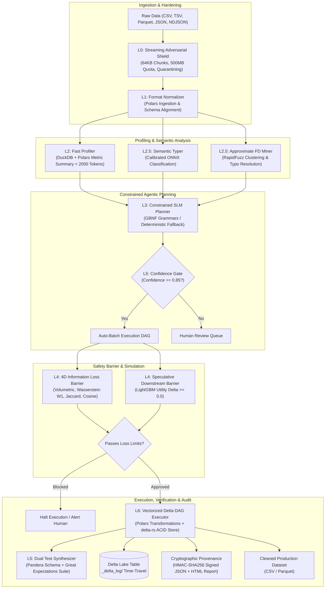

# NARVL Architectural Pipeline Flow

This document provides a concise and comprehensive overview of the architectural pipeline flow within **NARVL** (Offline Autonomous Agentic Data Cleaning Platform).

---

## 1. High-Level Architectural Flow

NARVL operates on an offline-first **L0 through L6 Autonomy Stack**, moving from raw input ingestion through safety barriers, constrained semantic reasoning, speculative loss estimation, and bitwise-reversible execution.



---

## 2. Pipeline Stages in Detail

### [Stage 1: L0 Streaming Adversarial Shield](file:///c:/College/SEM_V/CodeStorm/Team-NARVL/narvl/core/shield.py)
* **Component**: [`StreamingShield`](file:///c:/College/SEM_V/CodeStorm/Team-NARVL/narvl/core/shield.py#L38)
* **Responsibilities**:
  - Ingests incoming datasets in 64KB chunk streams.
  - Enforces a 500MB cumulative processing quota to protect against resource exhaustion (`QuotaExceededError`).
  - Cleans null bytes (`\x00`), fixes malformed encodings via `ftfy`, and isolates delimiter bombs and ragged rows directly into `quarantine.log`.
* **Output**: Sanitized local file stream with quarantined row count.

---

### [Stage 2: L1 Format Normalizer](file:///c:/College/SEM_V/CodeStorm/Team-NARVL/narvl/core/normalizer.py)
* **Component**: [`FormatNormalizer`](file:///c:/College/SEM_V/CodeStorm/Team-NARVL/narvl/core/normalizer.py#L18)
* **Responsibilities**:
  - Auto-detects and parses CSV, TSV, Parquet, JSON, and line-delimited JSON (NDJSON).
  - Unifies disparate sources into a high-performance, strongly typed [`polars.DataFrame`](file:///c:/College/SEM_V/CodeStorm/Team-NARVL/narvl/core/normalizer.py#L29).
* **Output**: In-memory Polars DataFrame representing the raw dataset.

---

### [Stage 3: L2 Fast Profiler](file:///c:/College/SEM_V/CodeStorm/Team-NARVL/narvl/core/profiler.py)
* **Component**: [`FastProfiler`](file:///c:/College/SEM_V/CodeStorm/Team-NARVL/narvl/core/profiler.py#L33)
* **Responsibilities**:
  - Computes column-level metrics (null counts, cardinality, numeric bounds, anomalies, duplicate row ratios) using vectorized DuckDB and Polars.
  - Produces an ultra-compact JSON profile summary strictly capped under 2,000 tokens.
* **Privacy Guarantee**: **Zero raw data leakage** — only statistical aggregations and column metadata are shared with downstream planners.

---

### [Stage 4: L2.5 Semantic Typing & Functional Dependency Mining](file:///c:/College/SEM_V/CodeStorm/Team-NARVL/narvl/core/semantic_typer.py)
* **Components**:
  - [`SemanticTyper`](file:///c:/College/SEM_V/CodeStorm/Team-NARVL/narvl/core/semantic_typer.py#L36): Employs a calibrated local ONNX classifier (`onnxruntime`) to categorize columns into semantic types (`City`, `State`, `PostalCode`, `Email`, `Currency`, `Timestamp`, etc.).
  - [`FunctionalDependencyMiner`](file:///c:/College/SEM_V/CodeStorm/Team-NARVL/narvl/core/fd_miner.py#L25): Discovers relational rules (e.g., `PostalCode -> State`) using RapidFuzz string clustering ($\ge 85\%$ similarity / edit distance $\le 1$) to correct typos and impute missing relationships.

---

### [Stage 5: L3 Constrained SLM Planner & Governance Gate](file:///c:/College/SEM_V/CodeStorm/Team-NARVL/narvl/engine/planner.py)
* **Components**:
  - [`SLMPlanner`](file:///c:/College/SEM_V/CodeStorm/Team-NARVL/narvl/engine/planner.py#L33): Generates a step-by-step cleaning DAG using local small language models (Qwen 0.5B via `llama-cpp-python`) constrained by strict GBNF grammars ([`narvl/engine/grammars.py`](file:///c:/College/SEM_V/CodeStorm/Team-NARVL/narvl/engine/grammars.py)) or deterministic rule fallbacks.
  - **Confidence Governance Gate**: Flags steps with confidence $\ge 0.85$ for automated batch execution; routes steps with confidence $< 0.85$ to the human review queue.

---

### [Stage 6: L4 4D Information Loss Barrier & Speculative Utility](file:///c:/College/SEM_V/CodeStorm/Team-NARVL/narvl/core/loss.py)
* **Component**: [`LossEstimator`](file:///c:/College/SEM_V/CodeStorm/Team-NARVL/narvl/core/loss.py#L42)
* **Responsibilities**: Performs a dry-run speculative transformation and measures distortion across 4 dimensions:
  1. **Volumetric Loss**: $\le 15\%$ row drop limit.
  2. **Statistical Drift**: Wasserstein distance $W_1 \le 0.35$ on numeric distributions.
  3. **Categorical Information Loss**: Jaccard distance $\le 0.30$.
  4. **Semantic Embedding Drift**: Cosine distance $\le 0.20$.
  5. **Downstream Utility Check**: Fast LightGBM proxy checking predictive utility change ($\Delta_{\text{util}} \ge 0.0$).
* **Barrier Action**: If safety thresholds are violated, the pipeline blocks execution before writing changes to disk.

---

### [Stage 7: L5 Dual Test Synthesizer](file:///c:/College/SEM_V/CodeStorm/Team-NARVL/narvl/core/test_gen.py)
* **Component**: [`DualTestSynthesizer`](file:///c:/College/SEM_V/CodeStorm/Team-NARVL/narvl/core/test_gen.py#L36)
* **Responsibilities**:
  - Automatically synthesizes dual verification suites from the cleaning DAG:
    - **Pandera** `DataFrameSchema` for strict type and boundary assertion.
    - **Great Expectations** Expectation Suite for column pair constraints and statistical properties.
  - Quarantines records that fail post-cleaning validation checks.

---

### [Stage 8: L6 Reversible Delta DAG Executor & Provenance](file:///c:/College/SEM_V/CodeStorm/Team-NARVL/narvl/core/executor.py)
* **Components**:
  - [`ReversibleExecutor`](file:///c:/College/SEM_V/CodeStorm/Team-NARVL/narvl/core/executor.py#L36): Executes vectorized Polars transformations, committing incremental states to Delta Lake (`delta-rs`) with ACID commit logs in `_delta_log/`.
  - **Bitwise Time-Travel**: Supports rolling back to any previous table version (`rollback_to_version(0)`) with 100% bitwise parity.
  - [`ProvenanceReporter`](file:///c:/College/SEM_V/CodeStorm/Team-NARVL/narvl/core/provenance.py#L35): Generates cryptographically signed audit manifests (`narvl_provenance_report.json` and interactive `narvl_provenance_report.html`) signed with HMAC-SHA256.

---

## 3. Data Transformations & State Transitions

| Phase | Input Format | Processing Unit | Output State |
| :--- | :--- | :--- | :--- |
| **0. Raw Ingestion** | File path (CSV / Parquet / JSON) | [`StreamingShield`](file:///c:/College/SEM_V/CodeStorm/Team-NARVL/narvl/core/shield.py#L38) | Sanitized byte stream + `quarantine.log` |
| **1. Normalization** | Sanitized stream | [`FormatNormalizer`](file:///c:/College/SEM_V/CodeStorm/Team-NARVL/narvl/core/normalizer.py#L18) | Standardized [`polars.DataFrame`](file:///c:/College/SEM_V/CodeStorm/Team-NARVL/narvl/core/normalizer.py#L29) |
| **2. Profiling** | Polars DataFrame | [`FastProfiler`](file:///c:/College/SEM_V/CodeStorm/Team-NARVL/narvl/core/profiler.py#L33) & [`SemanticTyper`](file:///c:/College/SEM_V/CodeStorm/Team-NARVL/narvl/core/semantic_typer.py#L36) | Token-budgeted Profile JSON & FD list |
| **3. Planning** | Profile JSON & Semantic Types | [`SLMPlanner`](file:///c:/College/SEM_V/CodeStorm/Team-NARVL/narvl/engine/planner.py#L33) | Validated Cleaning DAG (JSON) |
| **4. Pre-flight Check** | Raw DataFrame + Candidate DAG | [`LossEstimator`](file:///c:/College/SEM_V/CodeStorm/Team-NARVL/narvl/core/loss.py#L42) | 4D Loss Assessment & Utility Delta |
| **5. Execution** | Candidate DAG | [`ReversibleExecutor`](file:///c:/College/SEM_V/CodeStorm/Team-NARVL/narvl/core/executor.py#L36) | Delta Lake Table (`_delta_log/`) |
| **6. Verification** | Cleaned DataFrame | [`DualTestSynthesizer`](file:///c:/College/SEM_V/CodeStorm/Team-NARVL/narvl/core/test_gen.py#L36) | Verified Clean Asset + Quarantined Records |
| **7. Provenance** | Execution Metadata | [`ProvenanceReporter`](file:///c:/College/SEM_V/CodeStorm/Team-NARVL/narvl/core/provenance.py#L35) | HMAC-SHA256 Signed JSON & HTML Audit |

---

## 4. Triggering the Pipeline

NARVL exposes three entry points that execute this unified architectural flow:

1. **CLI Pipeline**:
   ```bash
   narvl clean messy_dataset.csv -o cleaned.csv --delta-dir ./delta_store
   ```
   *Entry function*: [`run_clean_pipeline`](file:///c:/College/SEM_V/CodeStorm/Team-NARVL/narvl/cli.py#L29) in [`narvl/cli.py`](file:///c:/College/SEM_V/CodeStorm/Team-NARVL/narvl/cli.py).

2. **CleanPilot Web UI**:
   ```bash
   narvl ui --port 8501
   ```
   *Entry module*: [`narvl/ui/app.py`](file:///c:/College/SEM_V/CodeStorm/Team-NARVL/narvl/ui/app.py), providing interactive 8-screen step-by-step visibility and manual review controls.

3. **Enterprise REST API**:
   ```bash
   narvl serve --port 8000
   ```
   *Endpoint*: `POST /api/v1/clean` in [`narvl/api/server.py`](file:///c:/College/SEM_V/CodeStorm/Team-NARVL/narvl/api/server.py) with JWT RBAC and Prometheus telemetry.
